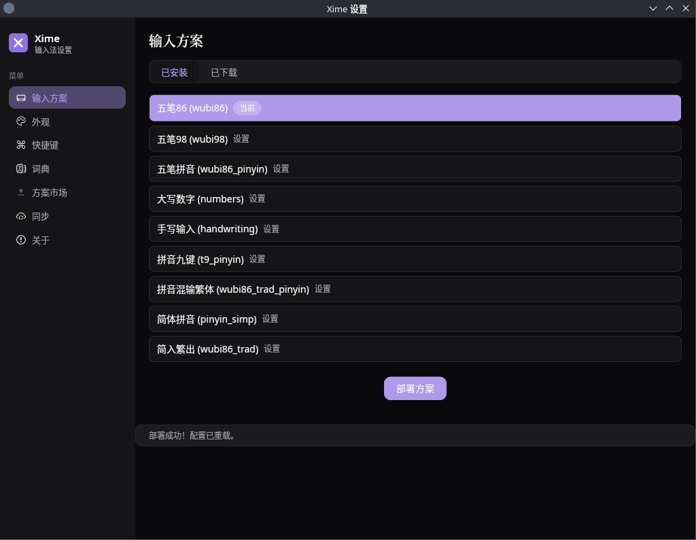

# XimeChe（曦码·澈输入法）

一个用 Rust 实现的 Linux 输入法，不依赖 ibus 和 fcitx，直接对接 Wayland 和 librime 实现。 

当前输入法不是 ibus 和 fcitx 的插件，而是一个独立的输入法程序。也就是说，xime 和 ibus 和 fcitx 没有任何关系。

> 目前还在开发中...很多功能暂时未实现
>
> 注意： 当前输入法只支持 wayland 应用和 KDE（KWin）桌面，不支持 Gnome 。因此你在登录KDE桌面时，需要选择 wayland 模式登录。
> 当前项目的代码实现只是符合了我自己的使用习惯。


## 特性

- 基于 Wayland `zwp_input_method_v1` 协议实现，直接对接 KWin
- librime 集成，复用现有五笔/拼音方案和词典
- 自绘候选窗 UI，纯 Rust 渲染
- 系统托盘 + 独立设置界面（Iced），支持动态切换输入方案
- 仅使用项目自带的 `rime-wubi` 方案，不混入系统 librime-data 内置方案

## 效果预览

候选窗：


设置界面：



## 架构

采用 **daemon + launcher** 分离架构，符合 KDE VirtualKeyboard 规范：

```
xime-wayland/
├── crates/
│   ├── xime-wayland/     # Wayland 协议层 (zwp_input_method_v1)
│   ├── xime-xkb/         # 键码转换层 (xkbcommon)
│   ├── xime-ui/          # 候选窗渲染 (tiny-skia + cosmic-text)
│   ├── xime-tray/        # 系统托盘 (StatusNotifierItem + DBusMenu)
│   ├── xime-daemon/      # 守护进程（DBus 服务 + Rime + Wayland）
│   ├── xime-launcher/    # KWin 入口（传递 WAYLAND_SOCKET fd）
│   ├── xime-setup/       # 设置界面薄壳二进制（Iced，依赖 libximecore）
│   └── xime-pack/        # Debian 打包配置
├── resources/
│   ├── dbus/             # DBus 服务文件
│   ├── applications/     # 桌面入口文件（xime-launcher / xime-setup）
│   └── icons/            # 多尺寸 PNG 应用图标
├── rime-wubi/            # 五笔/拼音方案数据（git 子模块）
└── dev-install.sh        # 开发安装脚本
```

共享基础设施来自 [libximecore](https://github.com/ximeiorg/libximecore)（git 依赖，本地开发时通过 `.cargo/config.toml` patch）：

- `librime-sys2` / `librime` — librime FFI 绑定与安全封装
- `xime-config` — 配置模型与 Rime 部署（Rime 数据目录由应用注入）
- `xime-setup-lib` — 设置界面组件（Iced）

数据流：

```
KWin → WAYLAND_SOCKET fd → launcher → DBus → daemon →
Wayland 连接 → 按键事件 → Rime → 候选词 → 提交文本
```

## 依赖

### 系统依赖

- `librime` (>= 1.8) - Rime 输入法引擎
- `libxkbcommon` (>= 1.0) - 键盘布局处理

安装方法：

```bash
# Ubuntu/Debian
sudo apt install librime-dev libxkbcommon-dev
```

五笔方案数据由项目自带（`rime-wubi` 子模块），安装时会自动部署到 `~/.config/xime/rime/`。
理论上，也支持其他方案。

## 安装

### 从 Debian 包安装

```bash
sudo dpkg -i xime_0.1.2-1_amd64.deb
```

安装后重新登录 KDE Plasma。

### 开发安装

构建依赖（Debian/Ubuntu）：

```bash
sudo apt install -y \
  build-essential cmake pkg-config \
  libboost-dev libboost-regex-dev libboost-filesystem-dev \
  libboost-locale-dev libboost-program-options-dev \
  libgoogle-glog-dev libgflags-dev \
  libyaml-cpp-dev libleveldb-dev libmarisa-dev libopencc-dev \
  libx11-dev libwayland-dev libxkbcommon-dev
```

```bash
./dev-install.sh
```

安装后需要重新登录 KDE Plasma 或重启 KWin。

## 配置

所有 Rime 数据统一放在 `~/.config/xime/rime/` 单目录：

- rime-wubi 方案源文件（`*.schema.yaml`、`*.dict.yaml`、`default.yaml`、`lua/`）
- librime 部署产物（`build/`）
- 用户词典与 `default.custom.yaml`

首次运行会自动创建配置目录和默认配置。系统安装时，daemon 首次启动会把 `/usr/share/xime/rime-data` 中的方案种子复制到用户目录。

### 设置界面

托盘菜单点击"设置..."打开设置界面（Iced），功能包括：
- 输入方案选择和详细配置（实时切换，经 DBus `SelectSchema` 通知 daemon）
- 外观设置（字体大小、候选词数量、主题色等）
- 词库管理、方案市场
- 关于信息

## 构建

```bash
cargo build --release
```

### 构建 Debian 包

```bash
cargo install cargo-deb
cargo deb -p xime
```

生成的 deb 包位于 `target/debian/xime_0.1.2-1_amd64.deb`。

## 运行

**目前仅支持 KDE Plasma (KWin)**，通过 VirtualKeyboard 机制自动启动。

### TODO

1. [x] xime-setup 完成 Rime 配置界面（Iced）
2. [x] 智能联想功能
3. [ ] 词条管理（编辑）
4. [ ] 跨平台剪切板


## FAQ

### Q: 为什么 VSCode 无法输入中文？

A: VSCode 需要以 Wayland 模式启动。官方网站下载的 VSCode 可以正常使用，但 Snap Store 版本不支持。

### Q: 如何切换中英文？

A: 点击托盘图标，或使用右键菜单"切换中英文"。支持 Shift 键切换（Shift_L 内联输入，Shift_R 提交文本）。

### Q: 如何添加新的输入方案？

A: 将方案文件复制到 `~/.config/xime/rime/`，然后在设置界面选择。

### Q: 为什么候选词数量是 20 而不是我配置的 5？

A: rime 中 schema 文件自身的 `menu.page_size` 优先级高于 `default.custom.yaml` 的 patch。请修改 `rime-wubi/` 对应 schema 文件中的 `menu.page_size`，或为方案添加 `<schema>.custom.yaml` 覆盖。

## 许可证

GPL-3.0-or-later

## 参考

- [wayland-rs](https://smithay.github.io/wayland-rs/)
- [librime](https://github.com/rime/librime)
- [Wayland 输入法协议实现现状](https://zhuanlan.zhihu.com/p/22611314767)